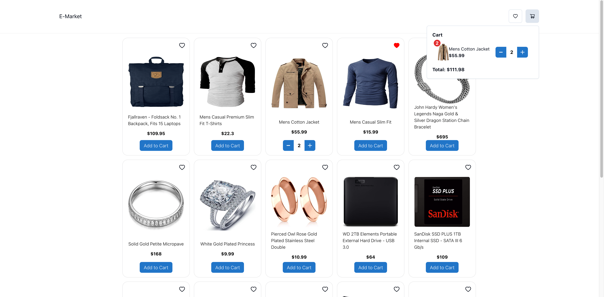

# Microfrontends Application with Webpack 5 Module Federation Plugin

## Screenshots



## Tech Stack

React, Typescript, Chakra UI, Webpack

##How it works ?

- `app1` expose Navbar component.
- `app2` expose ProductCard component.
- `container` import components that we exposed from other app.

#If you want to run your local environment you should run below command. This will run your whole applications at the same time and you will see the magic

```bash
npm start 
```

## Try It

[Demo](http://e-market-microfrontends.s3-website.eu-central-1.amazonaws.com)

